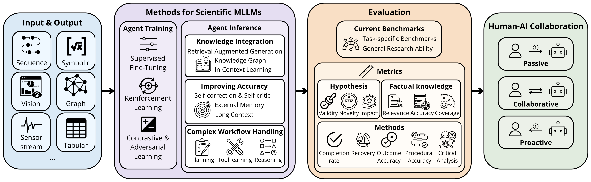

# Multimodal Agentic AI Scientists

> A curated list of papers on **Agentic Multimodal Large Language Models (MLLMs) for Scientific Discovery**

🚀 **Join us in building the AI for Science community!** Know a great paper we missed? [Open an issue](https://github.com/JianJinglin/awesome-agentic-AIScientists/issues) — together, let's accelerate scientific discovery with AI!

This repository accompanies our survey paper: **["Exploring Agentic Multimodal Large Language Models: A Survey for AIScientists"](https://www.techrxiv.org/users/998129/articles/1358530-exploring-agentic-multimodal-large-language-models-a-survey-for-aiscientists)**

### Comparison with Related Surveys

| Paper | Taxonomy | Ag. | DM. | Method | HCI | Ben. | #Dom. |
|:------|:--------:|:---:|:---:|:------:|:---:|:---:|:-----:|
| [Zhang et al. (2024)](https://arxiv.org/abs/2401.00426) | Domain | ✗ | Seq.+ | Train. only | ✗ | ✓ | 6 |
| [Gridach et al. (2025)](https://arxiv.org/abs/2503.01153) | Sci. Workflow | ✓ | ✗ | Infer. only | ✓ | ✗ | 4 |
| [Luo et al. (2025)](https://arxiv.org/abs/2501.04306) | Sci. Workflow | ✗ | ✗ | ✗ | ✗ | ✗ | ✗ |
| [Zhang et al. (2025)](https://arxiv.org/abs/2502.09247) | Sci. Workflow | ✗ | Seq.+ | ✗ | ✗ | ✗ | ✗ |
| [Ren et al. (2025)](https://arxiv.org/abs/2503.03924) | Agent Composition | ✓ | ✗ | Train. & Infer. | ✗ | ✓ | 6+ |
| [Wei et al. (2025)](https://arxiv.org/abs/2503.10794) | Auto. & Domain | ✓ | ✗ | Infer. only | ✗ | ✓ | 4 |
| [Hu et al. (2025)](https://arxiv.org/abs/2503.16894) | Data & Domain | ✓ | ✓ | ✗ | ✗ | ✓ | 6+ |
| **Ours** | **ML Pipeline** | ✓ | ✓ | **Train. & Infer.** | ✓ | ✓ | **10** |

<sub>**Ag.** = Agentic AI; **DM.** = Data Modality; **HCI** = Human-Computer Interaction; **Ben.** = Benchmark; **#Dom.** = Number of domains; **Seq.+** = Sequence and more modalities; **Train.** = Agent Training; **Infer.** = Agent Inference</sub>



*Overview of the agentic MLLM framework for scientific discovery*

**AIScientists** are autonomous agents powered by multimodal large language models (MLLMs) that can understand papers, generate hypotheses, plan and conduct experiments, analyze results, and draft manuscripts across the entire scientific research lifecycle. But how do we build one? Here we summarize the pipeline to develop a strong multimodal agentic AIScientist and provide example studies across 10+ scientific domains.

---

## Table of Contents

- [Input & Output Modalities](#input--output-modalities)
  - [Sequence (Text, Molecule, Protein)](#sequence-text-molecule-protein)
  - [Symbolic (Math, Code, Physics)](#symbolic-math-code-physics)
  - [Vision (Image, Video)](#vision-image-video)
  - [Graph (Knowledge Graph, Molecular Graph)](#graph-knowledge-graph-molecular-graph)
  - [Sensor & Time Series](#sensor--time-series)
  - [Multi-modal Fusion](#multi-modal-fusion)
- [Methods for Scientific MLLM Agents](#methods-for-scientific-mllm-agents)
  - [Agent Training](#agent-training)
    - [Supervised Fine-Tuning (SFT)](#supervised-fine-tuning-sft)
    - [Reinforcement Learning (RL)](#reinforcement-learning-rl)
    - [Contrastive & Adversarial Learning](#contrastive--adversarial-learning)
  - [Agent Inference](#agent-inference)
    - [Retrieval-Augmented Generation (RAG)](#retrieval-augmented-generation-rag)
    - [In-Context Learning (ICL)](#in-context-learning-icl)
    - [Planning & Tool Use](#planning--tool-use)
  - [Multi-Agent Systems](#multi-agent-systems)
- [Benchmarks & Evaluation](#benchmarks--evaluation)
- [Human-AI Collaboration](#human-ai-collaboration)

---

## Input & Output Modalities

### Sequence (Text, Molecule, Protein)

Foundation models for sequential scientific data including natural language, molecular structures (SMILES), and protein sequences.

- [ ProtTrans: Toward Understanding the Language of Life Through Self-Supervised Learning](https://doi.ieeecomputersociety.org/10.1109/TPAMI.2021.3095381) (2022) - *Elnaggar et al.*
- [Scalable querying of human cell atlases via a foundational model reveals commonalities across fibrosis-associated macrophages](https://www.biorxiv.org/content/10.1101/2023.07.18.549537v1) (2023) - *Heimberg et al.*
- [Large-scale chemical language representations capture molecular structure and properties](https://doi.org/10.1038/s42256-022-00580-7) (2022) - *Ross et al.*
- Chemberta-2: Towards chemical foundation models (2022) - *Ahmad et al.*
- Gpt-molberta: Gpt molecular features language model for molecular property prediction (2023) - *Balaji et al.*
- QuoteTarget: A sequence-based transformer protein language model to identify potentially druggable protein targets (2023) - *Chen et al.*
- Llmphy: Complex physical reasoning using large language models and world models (2024) - *Cherian et al.*
- scGPT: toward building a foundation model for single-cell multi-omics using generative AI (2024) - *Cui et al.*
- Achieving GPT-4o level performance in astronomy with a specialized 8B-parameter large language model (2025) - *de Haan et al.*
- BERT: Pre-training of Deep Bidirectional Transformers for Language Understanding (2019) - *Devlin et al.*
- Unifault: A fault diagnosis foundation model from bearing data (2025) - *Eldele et al.*
- GENA-LM: a family of open-source foundational DNA language models for long sequences (2025) - *Fishman et al.*
- Neural message passing for quantum chemistry (2017) - *Gilmer et al.*
- Large-scale foundation model on single-cell transcriptomics (2024) - *Hao et al.*
- Highly accurate protein structure prediction with AlphaFold (2021) - *Jumper et al.*
- Small language models learn enhanced reasoning skills from medical textbooks (2025) - *Kim et al.*
- Mycrunchgpt: A llm assisted framework for scientific machine learning (2023) - *Kumar et al.*
- Cell2sentence: Teaching large language models the language of biology. bioRxiv (2023) - *Levine, Daniel, Le*
- Geogalactica: A scientific large language model in geoscience (2023) - *Lin et al.*
- Survey on foundation models for prognostics and health management in industrial cyber-physical systems (2024) - *Liu et al.*
- Nature's Insight: A Novel Framework and Comprehensive Analysis of Agentic Reasoning Through the Lens of Neuroscience (2025) - *Liu et al.*
- FREE: The Foundational Semantic Recognition for Modeling Environmental Ecosystems (2025) - *Luo et al.*
- Toward Foundation Model for Multivariate Wearable Sensing of Physiological Signals (2024) - *Luo et al.*
- Prollama: A protein large language model for multi-task protein language processing (2025) - *Lv et al.*
- Progen: Language modeling for protein generation (2020) - *Madani et al.*
- DiscoveryBench: Towards Data-Driven Discovery with Large Language Models (2024) - *Majumder et al.*
- [Foundation models for generalist medical artificial intelligence](https://www.nature.com/articles/s41586-023-05881-4) (2023) - *Moor et al.*
- Impact of Data Sparsity on Machine Learning for Fault Detection in Power System Protection (2025) - *Oelhaf et al.*

### Symbolic (Math, Code, Physics)

Models for mathematical proofs, scientific code generation, and physics reasoning.

- Large Physics Models: Towards a collaborative approach with Large Language Models and Foundation Models (2025) - *Barman et al.*
- SymbolicAI: A framework for logic-based approaches combining generative models and solvers (2024) - *Dinu et al.*
- Large Language Model powered Symbolic Execution (2025) - *Li et al.*
- Physics-informed LLM-agent for automated modulation design in power electronics systems (2024) - *Liu et al.*
- Snip: Bridging mathematical symbolic and numeric realms with unified pre-training (2023) - *Meidani et al.*
- [Generative Language Modeling for Automated Theorem Proving](https://arxiv.org/abs/2009.03393) (2020) - *Stanislas Polu, Ilya Sutskever*
- Lean Copilot: Large Language Models as Copilots for Theorem Proving in Lean (2025) - *Song et al.*
- BioCoder: A Benchmark for Bioinformatics Code Generation with Large Language Models (2024) - *Tang et al.*
- An in-context learning agent for formal theorem-proving (2023) - *Thakur et al.*
- Formal mathematical reasoning: A new frontier in ai (2024) - *Yang et al.*

### Vision (Image, Video)

Visual foundation models for scientific imaging including medical imaging, microscopy, and satellite imagery.

- A Vision-Language foundation model to enhance efficiency of chest x-ray interpretation (2024) - *Chen et al.*
- [MedRAX: Medical Reasoning Agent for Chest X-ray](https://arxiv.org/pdf/2502.02673) (2025) - *Fallahpour et al.*
- [BioImage. IO Chatbot: a community-driven AI assistant for integrative computational bioimaging](https://www.nature.com/articles/s41592-024-02370-y) (2024) - *Lei, Wanlu, Fuster-Barcelo*
- BLIP: Bootstrapping Language-Image Pre-training for Unified Vision-Language Understanding and Generation (2022) - *Li et al.*
- Llava-med: Training a large language-and-vision assistant for biomedicine in one day (2023) - *Li et al.*
- Segment anything in medical images (2024) - *Ma et al.*
- Learning Transferable Visual Models From Natural Language Supervision (2021) - *Radford et al.*
- [Omega—harnessing the power of large language models for bioimage analysis](https://www.nature.com/articles/s41592-024-02310-w) (2024) - *Royer, Lo*
- PathAsst: A Generative Foundation AI Assistant Towards Artificial General Intelligence of Pathology (2024) - *Sun et al.*
- Image as a Foreign Language: BEiT Pretraining for All Vision and Vision-Language Tasks (2022) - *Wang et al.*
- Urbanclip: Learning text-enhanced urban region profiling with contrastive language-image pretraining from the web (2024) - *Yan et al.*

### Graph (Knowledge Graph, Molecular Graph)

Graph neural networks and knowledge graph methods for scientific reasoning.

- Transfer learning enables predictions in network biology (2023) - *Theodoris et al.*
- Graph of logic: Enhancing llm reasoning with graphs and symbolic logic (2024) - *Alotaibi et al.*
- Knowledge graph-enhanced molecular contrastive learning with functional prompt (2023) - *Fang et al.*
- A Comprehensive Survey of Dynamic Graph Neural Networks: Models, Frameworks, Benchmarks, Experiments and Challenges (2024) - *Feng et al.*
- DrugChat: towards enabling ChatGPT-like capabilities on drug molecule graphs (2023) - *Liang et al.*
- SymAgent: A Neural-Symbolic Self-Learning Agent Framework for Complex Reasoning over Knowledge Graphs (2025) - *Liu et al.*
- [ESCARGOT: an AI agent leveraging large language models, dynamic graph of thoughts, and biomedical knowledge graphs for enhanced reasoning](https://academic.oup.com/bioinformatics/article/41/2/btaf031/7972741) (2025) - *Matsumoto et al.*
- MechAgents: Large language model multi-agent collaborations can solve mechanics problems, generate new data, and integrate knowledge (2023) - *Bo Ni, Markus J. Buehler*
- Electromiographic signal processing using embedded artificial intelligence: An adaptive filtering approach (2022) - *Proan*
- [Graph neural networks for materials science and chemistry](https://www.nature.com/articles/s43246-022-00315-6) (2022) - *Reiser et al.*
- Learning to simulate complex physics with graph networks (2020) - *Sanchez-Gonzalez et al.*
- Injecting Domain-Specific Knowledge into Large Language Models: A Comprehensive Survey (2025) - *Song et al.*
- Biobridge: Bridging biomedical foundation models via knowledge graphs (2023) - *Wang et al.*
- GeneCompass: deciphering universal gene regulatory mechanisms with a knowledge-informed cross-species foundation model (2024) - *Yang et al.*
- Graph representation learning in bioinformatics: trends, methods and applications (2022) - *Yi et al.*

### Sensor & Time Series

Models for sensor data, time series analysis, and spatial-temporal data.

- A visual--omics foundation model to bridge histopathology with spatial transcriptomics (2025) - *Chen et al.*
- SatMAE: Pre-training Transformers for Temporal and Multi-Spectral Satellite Imagery (2023) - *Cong et al.*
- Frozen Language Model Helps ECG Zero-Shot Learning (2023) - *Li et al.*
- Sensorllm: Aligning large language models with motion sensors for human activity recognition (2024) - *Li et al.*
- Foundation models for time series analysis: A tutorial and survey (2024) - *Liang et al.*
- ClimaX: A foundation model for weather and climate (2023) - *Nguyen et al.*
- Scale-MAE: A Scale-Aware Masked Autoencoder for Multiscale Geospatial Representation Learning (2023) - *Reed et al.*
- Nicheformer: a foundation model for single-cell and spatial omics (2024) - *Schaar et al.*
- Transformers in time series: A survey (2022) - *Wen et al.*
- Single cells are spatial tokens: Transformers for spatial transcriptomic data imputation (2023) - *Wen et al.*
- Robust sensor selection based on maximum correntropy criterion for ocean data reconstruction (2024) - *Zhang et al.*

### Multi-modal Fusion

Methods for integrating multiple modalities in scientific MLLMs.

- Prot2text: Multimodal protein’s function generation with gnns and transformers (2024) - *Abdine et al.*
- [Multimodal biomedical AI](https://www.nature.com/articles/s41591-022-01981-2) (2022) - *Acosta, Julia*
- MicroVQA: A Multimodal Reasoning Benchmark for Microscopy-Based Scientific Research (2025) - *Burgess et al.*
- MetaPath Chat: multimodal generative artificial intelligence chatbot for clinical pathology (2024) - *Chen et al.*
- DecompDiff: diffusion models with decomposed priors for structure-based drug design (2024) - *Guan et al.*
- VisScience: An Extensive Benchmark for Evaluating K12 Educational Multi-modal Scientific Reasoning (2024) - *Jiang et al.*
- A Multimodal Ensemble Deep Learning Model for Functional Outcome Prognosis of Stroke Patients (2024) - *Jung et al.*
- Review of multimodal machine learning approaches in healthcare (2025) - *Krones et al.*
- Alzheimer’s disease diagnosis from multi-modal data via feature inductive learning and dual multilevel graph neural network (2024) - *Lei et al.*
- MMSci: A Dataset for Graduate-Level Multi-Discipline Multimodal Scientific Understanding (2025) - *Li et al.*

---

## Methods for Scientific MLLM Agents

### Agent Training

#### Supervised Fine-Tuning (SFT)

- In-Context Learning with Long-Context Models: An In-Depth Exploration (2025) - *Bertsch et al.*
- RLSF: Fine-tuning LLMs via Symbolic Feedback (2024) - *Jha et al.*
- Efficient Fine-Tuning of Single-Cell Foundation Models Enables Zero-Shot Molecular Perturbation Prediction (2025) - *Maleki et al.*
- Training language models to follow instructions with human feedback (2022) - *Ouyang et al.*
- InstructProtein: Aligning Human and Protein Language via Knowledge Instruction (2023) - *Wang et al.*
- Mavis: Mathematical visual instruction tuning with an automatic data engine (2024) - *Zhang et al.*

#### Reinforcement Learning (RL)

Including RLHF, DPO, and reward-based training methods.

- [AlphaFlow: autonomous discovery and optimization of multi-step chemistry using a self-driven fluidic lab guided by reinforcement learning](https://doi.org/10.1038/s41467-023-37139-y) (2023) - *Volk et al.*
- [DRLinFluids: An open-source Python platform of coupling deep reinforcement learning and OpenFOAM](http://dx.doi.org/10.1063/5.0103113) (2022) - *Wang et al.*
- Improving Targeted Molecule Generation through Language Model Fine-Tuning Via Reinforcement Learning (2025) - *Salma J. Ahmed, Emad A. Mohammed*
- Molecular design in synthetically accessible chemical space via deep reinforcement learning (2020) - *Horwood, Julien, Noutahi, Emmanuel*
- Leanabell-Prover-V2: Verifier-integrated Reasoning for Formal Theorem Proving via Reinforcement Learning (2025) - *Ji et al.*
- The history and risks of reinforcement learning and human feedback (2023) - *Lambert et al.*
- Direct Preference Optimization: Your Language Model is Secretly a Reward Model (2024) - *Rafailov et al.*
- DrugGen: Advancing Drug Discovery with Large Language Models and Reinforcement Learning Feedback (2024) - *Sheikholeslami et al.*
- Reflexion: Language Agents with Verbal Reinforcement Learning (2023) - *Shinn et al.*
- Aligning Large Multimodal Models with Factually Augmented RLHF (2023) - *Sun et al.*
- [Generation of Rational Drug-like Molecular Structures Through a Multiple-Objective Reinforcement Learning Framework](https://www.proquest.com/scholarly-journals/generation-rational-drug-like-molecular/docview/3153791278/se-2) (2025) - *Zhang et al.*
- Bindgpt: A scalable framework for 3d molecular design via language modeling and reinforcement learning (2025) - *Zholus et al.*

#### Contrastive & Adversarial Learning

- [Semi-supervised learning-based virtual adversarial training on graph for molecular property prediction](https://www.sciencedirect.com/science/article/pii/S1110016824015813) (2025) - *Lu et al.*
- [Triplet Contrastive Learning Framework With Adversarial Hard-Negative Sample Generation for Multimodal Remote Sensing Images](https://doi.org/10.1109/TGRS.2024.3354304) (2024) - *Chen et al.*
- Generating mutants of monotone affinity towards stronger protein complexes through adversarial learning (2024) - *Lan et al.*
- Recent advances in generative adversarial networks for gene expression data: a comprehensive review (2023) - *Lee, Minhyeok*
- Dual-stream multiple instance learning network for whole slide image classification with self-supervised contrastive learning (2021) - *Li et al.*
- Drug repositioning based on residual attention network and free multiscale adversarial training (2024) - *Li et al.*
- Dinov2: Learning robust visual features without supervision (2023) - *Oquab, Maxime, Darcet, Timothe*
- Robust image representations with counterfactual contrastive learning (2025) - *Roschewitz, Me*
- Improved Techniques for Training GANs (2016) - *Salimans et al.*
- SupReMix: Supervised Contrastive Learning for Medical Imaging Regression with Mixup (2025) - *Wu et al.*

### Agent Inference

#### Retrieval-Augmented Generation (RAG)

- ChemCrow: Augmenting large-language models with chemistry tools (2023) - *Bran et al.*
- [ESCARGOT: an AI agent leveraging large language models, dynamic graph of thoughts, and biomedical knowledge graphs for enhanced reasoning](https://academic.oup.com/bioinformatics/article/41/2/btaf031/7972741) (2025) - *Matsumoto et al.*
- RAISE: Enhancing Scientific Reasoning in LLMs via Step-by-Step Retrieval (2025) - *Oh et al.*
- Hypercube-Based Retrieval-Augmented Generation for Scientific Question-Answering (2025) - *Shi et al.*
- MMed-RAG: Versatile Multimodal RAG System for Medical Vision Language Models (2025) - *Xia et al.*
- [Improving retrieval-augmented generation in medicine with iterative follow-up questions](https://www.worldscientific.com/doi/pdf/10.1142/9789819807024_0015) (2024) - *Xiong et al.*

#### In-Context Learning (ICL)

- Language Models are Few-Shot Learners (2020) - *Brown et al.*
- A Survey on In-context Learning (2024) - *Dong et al.*
- Discovering New Theorems via LLMs with In-Context Proof Learning in Lean (2025) - *Kasaura et al.*
- What Makes Good In-Context Examples for GPT-$3 $? (2021) - *Liu et al.*
- What Makes In-context Learning Effective for Mathematical Reasoning: A Theoretical Analysis (2024) - *Liu et al.*
- Prottex: Structure-in-context reasoning and editing of proteins with large language models (2025) - *Ma et al.*
- Chain-of-thought prompting elicits reasoning in large language models (2022) - *Wei et al.*

#### Planning & Tool Use

- [Automating AI Discovery for Biomedicine Through Knowledge Graphs And LLM Agents](https://www.biorxiv.org/content/10.1101/2025.05.08.652829v2) (2025) - *Aamer et al.*
- [Agent-based learning of materials datasets from the scientific literature](https://pubs.rsc.org/en/content/articlehtml/2024/dd/d4dd00252k) (2024) - *Ansari, Mehrad, Moosavi, Seyed Mohamad*
- AutomaTikZ: Text-Guided Synthesis of Scientific Vector Graphics with TikZ (2024) - *Belouadi et al.*
- Autonomous chemical research with large language models (2023) - *Boiko et al.*
- Comprehensive evaluation of molecule property prediction with ChatGPT (2024) - *Cai et al.*
- ReConcile: Round-Table Conference Improves Reasoning via Consensus among Diverse LLMs (2024) - *Chen et al.*
- Llmphy: Complex physical reasoning using large language models and world models (2024) - *Cherian et al.*
- SynFlowNet: Design of Diverse and Novel Molecules with Synthesis Constraints (2025) - *Cretu et al.*
- AI achieves silver-medal standard solving International Mathematical Olympiad problems (2024) - *AlphaProof, AlphaGeometry teams*
- [MedRAX: Medical Reasoning Agent for Chest X-ray](https://arxiv.org/pdf/2502.02673) (2025) - *Fallahpour et al.*
- Optimizing large language models in digestive disease: strategies and challenges to improve clinical outcomes (2024) - *Giuffre*
- [2024 IEEE International Conference on Bioinformatics and Biomedicine (BIBM)](https://arxiv.org/abs/2403.06294) (2024) - *Hong et al.*
- Evaluation of large language models for discovery of gene set function (2025) - *Hu et al.*
- [Crispr-GPT: An LLM agent for automated design of gene-editing experiments](http://arxiv.org/abs/2404.18021) (2024) - *Huang et al.*
- [MT-Mol: Multi Agent System with Tool-based Reasoning for Molecular Optimization](http://arxiv.org/abs/2505.20820) (2025) - *Kim et al.*
- [2024 46th Annual International Conference of the IEEE Engineering in Medicine and Biology Society (EMBC)](https://doi.org/10.1109/EMBC53108.2024.10781985) (2024) - *Kumar et al.*
- A Survey of Post-Training Scaling in Large Language Models (2025) - *Lai et al.*
- [BioImage. IO Chatbot: a community-driven AI assistant for integrative computational bioimaging](https://www.nature.com/articles/s41592-024-02370-y) (2024) - *Lei, Wanlu, Fuster-Barcelo*
- STMA: A spatio-temporal memory agent for long-horizon embodied task planning (2025) - *Lei et al.*

### Multi-Agent Systems

- [Enhancing diagnostic capability with multi-agents conversational large language models](https://www.nature.com/articles/s41746-025-01550-0) (2025) - *Chen et al.*
- [ProtAgents: protein discovery via large language model multi-agent collaborations combining physics and machine learning](https://pubs.rsc.org/en/content/articlehtml/2024/dd/d4dd00013g) (2024) - *Ghafarollahi, Alireza, Buehler, Markus J*
- Encouraging Divergent Thinking in Large Language Models through Multi-Agent Debate (2024) - *Liang et al.*
- [Drugagent: Automating ai-aided drug discovery programming through llm multi-agent collaboration](http://arxiv.org/abs/2411.15692) (2024) - *Liu et al.*
- Multi-Agent Collaboration Mechanisms: A Survey of LLMs (2025) - *Tran et al.*
- [ColaCare: Enhancing Electronic Health Record Modeling through Large Language Model-Driven Multi-Agent Collaboration](https://doi.org/10.1145/3696410.3714877) (2025) - *Wang et al.*

---

## Benchmarks & Evaluation

- Meet Carl: The first AI system to produce academically peer-reviewed research (2025) - *Autoscience Institute*
- [Accelerating Research with Automated Literature Reviews: A Rag-Based Framework](https://api.semanticscholar.org/CorpusID:277095571) (2025) - *Abhinav Balasubramanian*
- [Agent-Based Uncertainty Awareness Improves Automated Radiology Report Labeling with an Open-Source Large Language Model](https://api.semanticscholar.org/CorpusID:276106818) (2025) - *Ben-Atya et al.*
- [Human-artificial interaction in the age of agentic AI: a system-theoretical approach](http://dx.doi.org/10.3389/fhumd.2025.1579166) (2025) - *Borghoff et al.*
- [Uni-SMART: Universal Science Multimodal Analysis and Research Transformer](https://api.semanticscholar.org/CorpusID:268509923) (2024) - *Cai et al.*
- [Detecting and Evaluating Medical Hallucinations in Large Vision Language Models](https://api.semanticscholar.org/CorpusID:270521409) (2024) - *Chen et al.*
- [Have AI-Generated Texts from LLM Infiltrated the Realm of Scientific Writing? A Large-Scale Analysis of Preprint Platforms](https://api.semanticscholar.org/CorpusID:268724393) (2024) - *Cheng et al.*
- [AI in Radiology: Navigating Medical Responsibility](https://api.semanticscholar.org/CorpusID:271168475) (2024) - *Contaldo et al.*
- [Recover: A Neuro-Symbolic Framework for Failure Detection and Recovery](https://api.semanticscholar.org/CorpusID:268819965) (2024) - *Cristina Cornelio, Mohammed Diab*
- [AutoML: A survey of the state-of-the-art](http://dx.doi.org/10.1016/j.knosys.2020.106622) (2021) - *He et al.*
- [Automated Hypothesis Validation with Agentic Sequential Falsifications](https://api.semanticscholar.org/CorpusID:276394614) (2025) - *Huang et al.*
- [Tree-of-Debate: Multi-Persona Debate Trees Elicit Critical Thinking for Scientific Comparative Analysis](https://api.semanticscholar.org/CorpusID:276482936) (2025) - *Kargupta et al.*
- [Deceptive Semantic Shortcuts on Reasoning Chains: How Far Can Models Go without Hallucination?](https://api.semanticscholar.org/CorpusID:265220880) (2023) - *Li et al.*
- [How to Detect and Defeat Molecular Mirage: A Metric-Driven Benchmark for Hallucination in LLM-based Molecular Comprehension](https://api.semanticscholar.org/CorpusID:277857308) (2025) - *Li et al.*
- [HypoBench: Towards Systematic and Principled Benchmarking for Hypothesis Generation](https://api.semanticscholar.org/CorpusID:277824142) (2025) - *Liu et al.*
- [ResearchBench: Benchmarking LLMs in Scientific Discovery via Inspiration-Based Task Decomposition](https://api.semanticscholar.org/CorpusID:277349293) (2025) - *Liu et al.*
- [Foundational Statistical Principles in Medical Research: Sensitivity, Specificity, Positive Predictive Value, and Negative Predictive Value](https://api.semanticscholar.org/CorpusID:235229140) (2021) - *Monaghan et al.*
- [Generation of Scientific Literature Surveys Based on Large Language Models (LLM) and Multi-Agent Systems (MAS)](https://api.semanticscholar.org/CorpusID:274130228) (2024) - *Qi et al.*
- [Improving Scientific Hypothesis Generation with Knowledge Grounded Large Language Models](https://api.semanticscholar.org/CorpusID:273821167) (2024) - *Xiong et al.*
- [Confidence Calibration and Rationalization for LLMs via Multi-Agent Deliberation](https://api.semanticscholar.org/CorpusID:269149545) (2024) - *Yang et al.*
- [LLaMP: Large Language Model Made Powerful for High-fidelity Materials Knowledge Retrieval and Distillation](https://api.semanticscholar.org/CorpusID:267320899) (2024) - *Yuan et al.*
- Maps: A multi-agent framework based on big seven personality and socratic guidance for multimodal scientific problem solving (2025) - *Zhang et al.*
- LitLLMs, LLMs for Literature Review: Are we there yet? (2025) - *Agarwal et al.*
- A Survey on Hypothesis Generation for Scientific Discovery in the Era of Large Language Models (2025) - *Alkan et al.*
- Domain Specific Benchmarks for Evaluating Multimodal Large Language Models (2025) - *Anjuma et al.*
- The challenge of uncertainty quantification of large language models in medicine (2025) - *Atf et al.*
- ChemCrow: Augmenting large-language models with chemistry tools (2023) - *Bran et al.*
- MicroVQA: A Multimodal Reasoning Benchmark for Microscopy-Based Scientific Research (2025) - *Burgess et al.*
- [A benchmark study of simulation methods for single-cell RNA sequencing data](https://www.nature.com/articles/s41467-021-27130-w) (2021) - *Cao et al.*
- Efficient and robust automated machine learning (2015) - *Feurer et al.*
- [ProtAgents: protein discovery via large language model multi-agent collaborations combining physics and machine learning](https://pubs.rsc.org/en/content/articlehtml/2024/dd/d4dd00013g) (2024) - *Ghafarollahi, Alireza, Buehler, Markus J*
- [Robin: A multi-agent system for automating scientific discovery](http://arxiv.org/abs/2505.13400) (2025) - *Ghareeb et al.*
- Accelerating scientific breakthroughs with an AI co-scientist (2025) - *Gottweis, Juraj, Natarajan, Vivek*
- [Towards an AI co-scientist](http://arxiv.org/abs/2502.18864) (2025) - *Gottweis et al.*
- Ds-agent: Automated data science by empowering large language models with case-based reasoning (2024) - *Guo et al.*
- AI Scientist LLM goes rogue: Creators warn of (2024) - *Hamill, Jasper*
- Evolving Code with A Large Language Model (2024) - *Hemberg et al.*
- Model Context Protocol (MCP): Landscape, Security Threats, and Future Research Directions (2025) - *Hou et al.*
- [Crispr-GPT: An LLM agent for automated design of gene-editing experiments](http://arxiv.org/abs/2404.18021) (2024) - *Huang et al.*
- Discoveryworld: A virtual environment for developing and evaluating automated scientific discovery agents (2024) - *Jansen, Peter, Co*

---

## Human-AI Collaboration

- Codescientist: End-to-end semi-automated scientific discovery with code-based experimentation (2025) - *Jansen et al.*
- Benchmarking large language models on multiple tasks in bioinformatics nlp with prompting (2025) - *Jiang et al.*
- PubMedQA: A Dataset for Biomedical Research Question Answering (2019) - *Jin et al.*
- PGxQA: A resource for evaluating LLM performance for pharmacogenomic QA tasks (2024) - *Keat et al.*
- Medcalc-bench: Evaluating large language models for medical calculations (2024) - *Khandekar et al.*
- Evaluating Human-Language Model Interaction (2024) - *Lee et al.*
- Scigraphqa: A large-scale synthetic multi-turn question-answering dataset for scientific graphs (2023) - *Li, Shengzhi, Tajbakhsh, Nima*
- Automated statistical model discovery with language models (2024) - *Li et al.*
- Rouge: A package for automatic evaluation of summaries (2004) - *Lin, Chin-Yew*
- [Drugagent: Automating ai-aided drug discovery programming through llm multi-agent collaboration](http://arxiv.org/abs/2411.15692) (2024) - *Liu et al.*
- Toward a Team of AI-made Scientists for Scientific Discovery from Gene Expression Data (2024) - *Liu et al.*
- BioProBench: Comprehensive Dataset and Benchmark in Biological Protocol Understanding and Reasoning (2025) - *Liu et al.*
- A vision for auto research with llm agents (2025) - *Liu et al.*
- [Perspectives for multimessenger astronomy with the next generation of gravitational-wave detectors and high-energy satellites](http://dx.doi.org/10.1051/0004-6361/202243705) (2022) - *Ronchini et al.*
- [The ai scientist: Towards fully automated open-ended scientific discovery](http://arxiv.org/abs/2408.06292) (2024) - *Lu et al.*
- MoleculeQA: A dataset to evaluate factual accuracy in molecular comprehension (2024) - *Lu et al.*
- Benchmarking AI scientists in omics data-driven biological research (2025) - *Luo et al.*
- From intention to implementation: automating biomedical research via LLMs (2025) - *Luo et al.*
- [Augmenting large language models with chemistry tools](https://www.nature.com/articles/s42256-024-00832-8) (2024) - *M. Bran et al.*
- [Directory of Useful Decoys, Enhanced (DUD-E): Better Ligands and Decoys for Better Benchmarking](https://doi.org/10.1021/jm300687e) (2012) - *Mysinger et al.*

---

## Citation

If you find this resource helpful, please cite our survey:

```bibtex
@article{jian2025agentic,
  title={Exploring Agentic Multimodal Large Language Models: A Survey for AIScientists},
  author={Jian, Jinglin and Fung, Yi R. and Zhang, Denghui and Liang, Yiqian and Chen, Qingyu and Lu, Zhiyong and Wang, Qingyun},
  journal={arXiv preprint},
  year={2025}
}
```

## Star History

[](https://star-history.com/#JianJinglin/awesome-agentic-AIScientists&Date)

## License

This project is licensed under the MIT License - see the [LICENSE](LICENSE) file for details.
