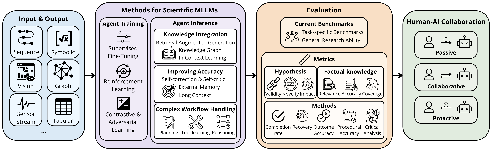

# Multimodal Agentic AI Scientists

> A curated list of papers on **Agentic Multimodal Large Language Models (MLLMs) for Scientific Discovery**

🚀 **Join us in building the AI for Science community!** Know a great paper we missed? [Open an issue](https://github.com/JianJinglin/awesome-agentic-AIScientists/issues) — together, let's accelerate scientific discovery with AI!

This repository accompanies our survey paper: **["Exploring Agentic Multimodal Large Language Models: A Survey for AIScientists"](https://www.techrxiv.org/users/998129/articles/1358530-exploring-agentic-multimodal-large-language-models-a-survey-for-aiscientists)**

### What is an AIScientist?

**AIScientists** are autonomous agents powered by multimodal large language models (MLLMs) that can understand papers, generate hypotheses, plan and conduct experiments, analyze results, and draft manuscripts across the scientific research lifecycle. Recent systems span open-ended AI research ([Lu et al., 2024](http://arxiv.org/abs/2408.06292); [Lu et al., 2026](https://www.nature.com/articles/s41586-026-10265-5)), biomedical hypothesis generation ([Gottweis et al., 2026](https://www.nature.com/articles/s41586-026-10644-y)), automated biology discovery ([Ghareeb et al., 2026](https://www.nature.com/articles/s41586-026-10652-y)), and empirical software generation ([Aygün et al., 2026](https://www.nature.com/articles/s41586-026-10658-6)). This survey summarizes a complete pipeline for developing multimodal agentic AIScientists, with representative studies spanning 10 scientific domains.

### Comparison with Related Surveys

Prior surveys examine scientific AI agents by workflow stages, autonomy levels, domain resources, or automation-to-autonomy transitions. Our survey adds a **pipeline-oriented** view across modalities, agent training, inference-time methods, benchmarks, and human-AI collaboration, clarifying how multimodal scientific agents are built, where costs arise, and which human checkpoints remain necessary.

| Paper | Taxonomy | Ag. | DM. | Method | HCI | Ben. | #Dom. |
|:------|:--------:|:---:|:---:|:------:|:---:|:---:|:-----:|
| [Zhang et al. (2024)](https://aclanthology.org/2024.emnlp-main.498/) | Domain | ✗ | Seq.+ | Train. only | ✗ | ✓ | 6 |
| [Gridach et al. (2025)](https://arxiv.org/abs/2503.08979) | Research Workflow | ✓ | ✗ | Infer. only | ✓ | ✗ | 4 |
| [Luo et al. (2025)](https://arxiv.org/abs/2501.04306) | Research Workflow | ✗ | ✗ | ✗ | ✗ | ✗ | ✗ |
| [Zhang et al. (2025)](https://www.nature.com/articles/s44387-025-00019-5) | Research Workflow | ✗ | Seq.+ | ✗ | ✗ | ✗ | ✗ |
| [Ren et al. (2025)](https://arxiv.org/abs/2503.24047) | Agent Composition | ✓ | ✗ | Train. & Infer. | ✗ | ✓ | 6+ |
| [Wei et al. (2025)](https://arxiv.org/abs/2508.14111) | Auto. & Domain | ✓ | ✗ | Infer. only | ✗ | ✓ | 4 |
| [Hu et al. (2025)](https://arxiv.org/abs/2508.21148) | Data & Domain | ✓ | ✓ | ✗ | ✗ | ✓ | 6+ |
| [Zheng et al. (2025)](https://aclanthology.org/2025.emnlp-main.895/) | Research Workflow & Auto. | ✓ | ✗ | Infer. only | ✓ | ✓ | 6+ |
| [Zhou et al. (2025)](https://aclanthology.org/2025.findings-emnlp.631/) | Research Workflow | ✓ | ✗ | Infer. only | ✓ | ✓ | 6+ |
| **Ours** | **ML & Research Pipeline** | ✓ | ✓ | **Train. & Infer.** | ✓ | ✓ | **10** |

**Ag.** = Agentic AI; **DM.** = Data Modality; **HCI** = Human-Computer Interaction; **Ben.** = Benchmark; **#Dom.** = Number of domains; **Seq.+** = Sequence and more modalities; **Train.** = Agent Training; **Infer.** = Agent Inference; **Auto.** = Autonomy Level

### Ours: An End-to-End Developer Pipeline

*Overview of our framework: Starting from diverse **Input & Output** modalities, through **Agent Training** and **Inference** methods, to **Evaluation** benchmarks, with **Human-AI Collaboration** integrated at every stage.*

---

## Table of Contents

- [⚙️ Methods for Scientific MLLM Agents](#️-methods-for-scientific-mllm-agents)
  - [🏋️ Agent Training](#️-agent-training)
  - [🚀 Agent Inference](#-agent-inference)
  - [🤝 Multi-Agent Systems](#-multi-agent-systems)
- [📈 Benchmarks & Evaluation](#-benchmarks--evaluation)
- [🧑‍🔬 Human-AI Collaboration](#-human-ai-collaboration)

---

## ⚙️ Methods for Scientific MLLM Agents

Scientific MLLM agents need more than generic instruction following: they must learn domain representations, call tools, ground decisions in evidence, and recover when execution contradicts the plan.

### 🏋️ Agent Training

#### Supervised Fine-Tuning & Tool Instruction

- [SciBERT: A Pretrained Language Model for Scientific Text](https://arxiv.org/abs/1903.10676) (2019) - *Beltagy et al.*
- [Gorilla: Large Language Model Connected with Massive APIs](https://arxiv.org/abs/2305.15334) (2023) - *Patil et al.*
- [ToolLLM: Facilitating Large Language Models to Master 16000+ Real-world APIs](https://arxiv.org/abs/2307.16789) (2024) - *Qin et al.*
- [A Multimodal Conversational Agent for DNA, RNA and Protein Tasks](https://doi.org/10.1038/s42256-025-01047-1) (2025) - *de Almeida et al.*
- [TxGemma: Efficient and Agentic LLMs for Therapeutics](http://arxiv.org/abs/2504.06196) (2025) - *Wang et al.*
- [ProtAgents: Protein Discovery via Large Language Model Multi-Agent Collaborations Combining Physics and Machine Learning](https://pubs.rsc.org/en/content/articlehtml/2024/dd/d4dd00013g) (2024) - *Ghafarollahi & Buehler*

#### Reinforcement Learning & Verifier Feedback

- [Training Language Models to Follow Instructions with Human Feedback](https://arxiv.org/abs/2203.02155) (2022) - *Ouyang et al.*
- [Direct Preference Optimization: Your Language Model is Secretly a Reward Model](https://arxiv.org/abs/2305.18290) (2024) - *Rafailov et al.*
- [ResearchAgent: Iterative Research Idea Generation over Scientific Literature with Large Language Models](https://aclanthology.org/2025.naacl-long.342/) (2025) - *Baek et al.*
- [Agent Hospital: A Simulacrum of Hospital with Evolvable Medical Agents](https://arxiv.org/abs/2405.02957) (2024) - *Li et al.*
- [Automating Alloy Design and Discovery with Physics-Aware Multimodal Multiagent AI](https://www.pnas.org/doi/abs/10.1073/pnas.2414074122) (2025) - *Ghafarollahi et al.*
- [AI Achieves Silver-Medal Standard Solving International Mathematical Olympiad Problems](https://deepmind.google/discover/blog/ai-solves-imo-problems-at-silver-medal-level/) (2024) - *AlphaProof & AlphaGeometry teams*
- [Generation of Rational Drug-like Molecular Structures Through a Multiple-Objective Reinforcement Learning Framework](https://www.proquest.com/scholarly-journals/generation-rational-drug-like-molecular/docview/3153791278/se-2) (2025) - *Zhang et al.*

#### Contrastive & Adversarial Learning

- [DrugCLIP: Contrastive Protein-Molecule Representation Learning for Virtual Screening](https://papers.neurips.cc/paper_files/paper/2023/file/8bd31288ad8e9a31d519fdeede7ee47d-Paper-Conference.pdf) (2023) - *Gao et al.*
- [Triplet Contrastive Learning Framework with Adversarial Hard-Negative Sample Generation for Multimodal Remote Sensing Images](https://doi.org/10.1109/TGRS.2024.3354304) (2024) - *Chen et al.*
- [Generating Mutants of Monotone Affinity Towards Stronger Protein Complexes Through Adversarial Learning](https://doi.org/10.1038/s42256-024-00803-z) (2024) - *Lan et al.*
- [Drug Repositioning Based on Residual Attention Network and Free Multiscale Adversarial Training](https://doi.org/10.1186/s12859-024-05893-5) (2024) - *Li et al.*
- [EPIPDLF: A Pretrained Deep Learning Framework for Predicting Enhancer-Promoter Interactions](https://doi.org/10.1093/bioinformatics/btae716) (2025) - *Xiao et al.*
- [Improved Techniques for Training GANs](https://proceedings.neurips.cc/paper/2016/hash/8a3363abe792db2d8761d6403605aeb7-Abstract.html) (2016) - *Salimans et al.*

### 🚀 Agent Inference

#### Knowledge Grounding: RAG, Knowledge Graphs & ICL

- [ClinicalRAG: Enhancing Clinical Decision Support Through Heterogeneous Knowledge Retrieval](https://aclanthology.org/2024.knowllm-1.6/) (2024) - *Lu et al.*
- [AutoProteinEngine: A Large Language Model Driven Agent Framework for Multimodal AutoML in Protein Engineering](https://aclanthology.org/2025.coling-industry.36/) (2025) - *Liu et al.*
- [ESCARGOT: An AI Agent Leveraging Large Language Models, Dynamic Graph of Thoughts, and Biomedical Knowledge Graphs for Enhanced Reasoning](https://academic.oup.com/bioinformatics/article/41/2/btaf031/7972741) (2025) - *Matsumoto et al.*
- [A Framework for Autonomous AI-Driven Drug Discovery](https://www.biorxiv.org/content/10.1101/2024.12.17.629024v2) (2024) - *Selinger et al.*
- [Automating AI Discovery for Biomedicine Through Knowledge Graphs and LLM Agents](https://www.biorxiv.org/content/10.1101/2025.05.08.652829v2) (2025) - *Aamer et al.*
- [BioImage.IO Chatbot: A Community-Driven AI Assistant for Integrative Computational Bioimaging](https://www.nature.com/articles/s41592-024-02370-y) (2024) - *Lei et al.*
- [A Survey on In-Context Learning](https://arxiv.org/abs/2301.00234) (2024) - *Dong et al.*

#### Planning, Tool Use & Workflow Control

- [ScienceAgentBench: Toward Rigorous Assessment of Language Agents for Data-Driven Scientific Discovery](https://arxiv.org/abs/2410.05080) (2025) - *Chen et al.*
- [Model Context Protocol (MCP): Landscape, Security Threats, and Future Research Directions](https://arxiv.org/abs/2503.23278) (2025) - *Hou et al.*
- [Democratizing AI Scientists Using ToolUniverse](https://arxiv.org/abs/2509.23426) (2025) - *Gao et al.*
- [Biomni: A General-Purpose Biomedical AI Agent](https://biomni.stanford.edu/paper.pdf) (2025) - *Huang et al.*
- [MedRAX: Medical Reasoning Agent for Chest X-ray](https://arxiv.org/abs/2502.02673) (2025) - *Fallahpour et al.*
- [CRISPR-GPT: An LLM Agent for Automated Design of Gene-Editing Experiments](http://arxiv.org/abs/2404.18021) (2024) - *Huang et al.*
- [CACTUS: Chemistry Agent Connecting Tool Usage to Science](https://doi.org/10.1021/acsomega.4c08408) (2024) - *McNaughton et al.*
- [Augmenting Large Language Models with Chemistry Tools](https://www.nature.com/articles/s42256-024-00832-8) (2024) - *Bran et al.*
- [Omega: Harnessing the Power of Large Language Models for Bioimage Analysis](https://www.nature.com/articles/s41592-024-02310-w) (2024) - *Royer*
- [MT-Mol: Multi Agent System with Tool-Based Reasoning for Molecular Optimization](http://arxiv.org/abs/2505.20820) (2025) - *Kim et al.*

#### Full-Loop & Self-Correcting Agents

- [The AI Scientist-v2: Workshop-Level Automated Scientific Discovery via Agentic Tree Search](https://arxiv.org/abs/2504.08066) (2025) - *Yamada et al.*
- [Towards End-to-End Automation of AI Research](https://www.nature.com/articles/s41586-026-10265-5) (2026) - *Lu et al.*
- [Accelerating Scientific Discovery with Co-Scientist](https://www.nature.com/articles/s41586-026-10644-y) (2026) - *Gottweis et al.*
- [A Multi-Agent System for Automating Scientific Discovery](https://www.nature.com/articles/s41586-026-10652-y) (2026) - *Ghareeb et al.*
- [An AI System to Help Scientists Write Expert-Level Empirical Software](https://www.nature.com/articles/s41586-026-10658-6) (2026) - *Aygün et al.*
- [Reflexion: Language Agents with Verbal Reinforcement Learning](https://arxiv.org/abs/2303.11366) (2023) - *Shinn et al.*
- [ArgMed-Agents: Explainable Clinical Decision Reasoning with LLM Discussion via Argumentation Schemes](https://arxiv.org/abs/2403.06294) (2024) - *Hong et al.*
- [GeneAgent: Self-Verification Language Agent for Gene Set Knowledge Discovery Using Domain Databases](http://arxiv.org/abs/2405.16205) (2024) - *Wang et al.*

### 🤝 Multi-Agent Systems

- [Multi-Agent Collaboration Mechanisms: A Survey of LLMs](https://arxiv.org/abs/2501.06322) (2025) - *Tran et al.*
- [ProtAgents: Protein Discovery via Large Language Model Multi-Agent Collaborations Combining Physics and Machine Learning](https://pubs.rsc.org/en/content/articlehtml/2024/dd/d4dd00013g) (2024) - *Ghafarollahi & Buehler*
- [Automating Alloy Design and Discovery with Physics-Aware Multimodal Multiagent AI](https://www.pnas.org/doi/abs/10.1073/pnas.2414074122) (2025) - *Ghafarollahi et al.*
- [TriageAgent: Towards Better Multi-Agents Collaborations for Large Language Model-Based Clinical Triage](https://aclanthology.org/2024.findings-emnlp.329/) (2024) - *Lu et al.*
- [MedAgents: Large Language Models as Collaborators for Zero-Shot Medical Reasoning](https://aclanthology.org/2024.findings-acl.33/) (2024) - *Tang et al.*
- [MDAgents: An Adaptive Collaboration of LLMs for Medical Decision-Making](https://proceedings.neurips.cc/paper_files/paper/2024/file/90d1fc07f46e31387978b88e7e057a31-Paper-Conference.pdf) (2024) - *Kim et al.*
- [ColaCare: Enhancing Electronic Health Record Modeling Through Large Language Model-Driven Multi-Agent Collaboration](https://doi.org/10.1145/3696410.3714877) (2025) - *Wang et al.*
- [DrugAgent: Automating AI-Aided Drug Discovery Programming Through LLM Multi-Agent Collaboration](http://arxiv.org/abs/2411.15692) (2024) - *Liu et al.*
- [Synthetic Arabic Medical Dialogues Using Advanced Multi-Agent LLM Techniques](https://aclanthology.org/2024.arabicnlp-1.2/) (2024) - *ALMutairi et al.*
- [Advancing Healthcare Automation: Multi-Agent System for Medical Necessity Justification](https://aclanthology.org/2024.bionlp-1.4/) (2024) - *Pandey et al.*

---

## 📈 Benchmarks & Evaluation

- [Learn to Explain: Multimodal Reasoning via Thought Chains for Science Question Answering](https://arxiv.org/abs/2209.09513) (2022) - *Lu et al.*
- [DiscoveryWorld: A Virtual Environment for Developing and Evaluating Automated Scientific Discovery Agents](https://arxiv.org/abs/2406.06769) (2024) - *Jansen et al.*
- [ScienceAgentBench: Toward Rigorous Assessment of Language Agents for Data-Driven Scientific Discovery](https://arxiv.org/abs/2410.05080) (2025) - *Chen et al.*
- [Collaborative Gym: A Framework for Enabling and Evaluating Human-Agent Collaboration](https://arxiv.org/abs/2412.15701) (2025) - *Shao et al.*
- [HypoBench: Towards Systematic and Principled Benchmarking for Hypothesis Generation](https://arxiv.org/abs/2504.11524) (2025) - *Liu et al.*
- [ResearchBench: Benchmarking LLMs in Scientific Discovery via Inspiration-Based Task Decomposition](https://arxiv.org/abs/2503.21248) (2025) - *Liu et al.*
- [Can LLMs Generate Novel Research Ideas? A Large-Scale Human Study with 100+ NLP Researchers](https://arxiv.org/abs/2409.04109) (2024) - *Si et al.*
- [Automated Hypothesis Validation with Agentic Sequential Falsifications](https://api.semanticscholar.org/CorpusID:276394614) (2025) - *Huang et al.*
- [Detecting Hallucinations in Large Language Models Using Semantic Entropy](https://www.nature.com/articles/s41586-024-07421-0) (2024) - *Farquhar et al.*
- [LLM Hallucinations in the Wild: Large-Scale Evidence from Non-Existent Citations](https://arxiv.org/abs/2605.07723) (2026) - *Zhao et al.*
- [Evaluating Large Language Model Agents for Automation of Atomic Force Microscopy](https://www.nature.com/articles/s41467-025-64105-7) (2025) - *Mandal et al.*
- [How to Detect and Defeat Molecular Mirage: A Metric-Driven Benchmark for Hallucination in LLM-Based Molecular Comprehension](https://api.semanticscholar.org/CorpusID:277857308) (2025) - *Li et al.*
- [Detecting and Evaluating Medical Hallucinations in Large Vision Language Models](https://api.semanticscholar.org/CorpusID:270521409) (2024) - *Chen et al.*
- [LitLLMs, LLMs for Literature Review: Are We There Yet?](https://arxiv.org/abs/2412.15249) (2025) - *Agarwal et al.*
- [MAPS: A Multi-Agent Framework Based on Big Seven Personality and Socratic Guidance for Multimodal Scientific Problem Solving](https://arxiv.org/abs/2503.16905) (2025) - *Zhang et al.*

---

## 🧑‍🔬 Human-AI Collaboration

- [Exploring Collaboration Patterns and Strategies in Human-AI Co-Creation Through the Lens of Agency](https://arxiv.org/abs/2507.06000) (2025) - *Zhang et al.*
- [AI-Researcher: Autonomous Scientific Innovation](https://arxiv.org/abs/2505.18705) (2025) - *Tang et al.*
- [Automated Statistical Model Discovery with Language Models](https://arxiv.org/abs/2402.17879) (2024) - *Li et al.*
- [Collaborative Gym: A Framework for Enabling and Evaluating Human-Agent Collaboration](https://arxiv.org/abs/2412.15701) (2025) - *Shao et al.*
- [The Virtual Lab of AI Agents Designs New SARS-CoV-2 Nanobodies](https://www.nature.com/articles/s41586-025-09442-9) (2025) - *Swanson et al.*
- [FutureHouse Platform: Superintelligent AI Agents for Scientific Discovery](https://www.futurehouse.org/research-announcements/launching-futurehouse-platform-ai-agents) (2025) - *Skarlinski et al.*
- [ResearchAgent: Iterative Research Idea Generation over Scientific Literature with Large Language Models](https://aclanthology.org/2025.naacl-long.342/) (2025) - *Baek et al.*
- [Agent Laboratory: Using LLM Agents as Research Assistants](https://arxiv.org/abs/2501.04227) (2025) - *Schmidgall et al.*
- [An AI Agent for Fully Automated Multi-Omic Analyses](https://advanced.onlinelibrary.wiley.com/doi/full/10.1002/advs.202407094) (2024) - *Zhou et al.*
- [DrugAgent: Automating AI-Aided Drug Discovery Programming Through LLM Multi-Agent Collaboration](http://arxiv.org/abs/2411.15692) (2024) - *Liu et al.*
- [Toward a Team of AI-Made Scientists for Scientific Discovery from Gene Expression Data](https://arxiv.org/abs/2402.12391) (2024) - *Liu et al.*
- [CodeScientist: End-to-End Semi-Automated Scientific Discovery with Code-Based Experimentation](https://arxiv.org/abs/2503.22708) (2025) - *Jansen et al.*
- [The AI Scientist: Towards Fully Automated Open-Ended Scientific Discovery](http://arxiv.org/abs/2408.06292) (2024) - *Lu et al.*
- [Accelerating Scientific Discovery with Co-Scientist](https://www.nature.com/articles/s41586-026-10644-y) (2026) - *Gottweis et al.*
- [A Multi-Agent System for Automating Scientific Discovery](https://www.nature.com/articles/s41586-026-10652-y) (2026) - *Ghareeb et al.*
- [Localization, Inspection, and Reasoning Module for Autonomous Workflows in Self-Driving Laboratories](https://www.nature.com/articles/s42004-025-01770-1) (2025) - *Zhou et al.*
- [Evaluating Large Language Model Agents for Automation of Atomic Force Microscopy](https://www.nature.com/articles/s41467-025-64105-7) (2025) - *Mandal et al.*

---

## License

This project is licensed under the MIT License - see the [LICENSE](LICENSE) file for details.
